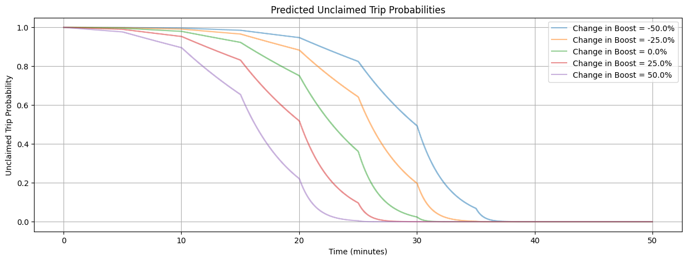
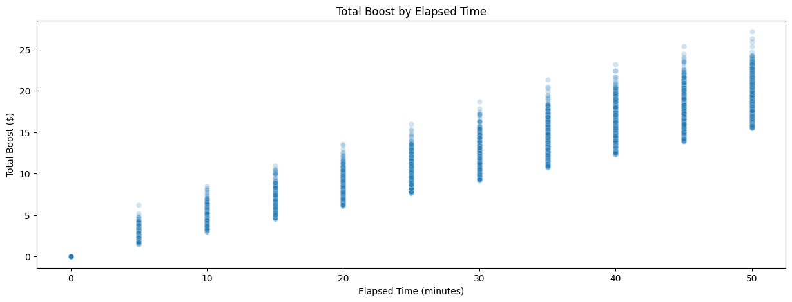

## Technical Assessment Documentation

### 1. Main recommentations
#### Delay initial boosts
One clear finding in the data is that we may be applying boosts too quickly. Despite an average lead time of over 35 hours between a trip being offered and the start time of the trip, we begin applying boosts in regular intervals within 5 minutes of the initial offer. The result is that all rides that are ultimately claimed are claimed within one hour, leaving over 34 hours of lead time.

While having rides claimed early is positive for ensuring that all rides are claimed, these timing dynamics suggest that our boost timing may be overly aggressive. This in turn may cause us to overpay.

#### Vary boost timing and sizing

The main problem in the current data is the nearly perfect correlation between the time elapsed since a ride is posted, the number of boosts applied, and the total boost size. Boost sizing is almost perfectly uniform, regardless of base price, metro area, or boost number. The correlation between these three features leaves insufficient variation in the data to reliably model their effects on the probability of a ride being claimed. The best way to resolve this is to introduce more variation into the data. 
The plot below shows the average total boost level for all claimed trips, by elapsed time. The intervals are consistent and total boosts increase linearly. 

Fortunately, the data suggest that there is ample flexibility to introduce this variation, with minimal risk to all rides being claimed. In fact, there is likely room to introduce this variation while _saving money_ on boosts. 

Introducing variation here will improve our ability to model the actual effects of boosts on claims. But this uniformity in total boost for claimed trips also suggests 

### 2. Additional data needs
As mentioned above, the clear data need is _variation in boost size and timing_, rather than new features. However, there are additional data that would allow for more precise modeling.

Information on the geographic proximity of drivers to offered trips would allow us to predict the effectiveness of boosts more precisely. We could make boosts dynamic/dependent on a driver's specific context.

This would also be helped by individual drivers' historical behavior relative to offered boosts.

### 3. Confidence in assumptions leading to improvements
If there is any relationship between boosts and the probability of a trip being claimed, introducing more variation into the data, particularly insofar as it reduces correlation with other variables, is almost guaranteed to increase our ability to build a predictive model.

Whether driver-specific data would help us improve model performance is less certain, and would depend on there being systematic differences between drivers' responses to boosts. It is plausible that such differences exist, but it is theoretically much less certain than that there is a statistical relationship between boosts and claims.

### 4. Process improvements
1. Experimentation with boost timing
- This need not even require changing the sizing of average frequency of boosts. Useful variation could be introduced into the data by simply varying the timing of boosts between drivers (e.g. 50% of drivers get the same boost 1 minute later).
- Ideally, vary the entire window in which boosts are offered. Do this by lengthening the time the original offer is in place, before boosts are applied, and, subsequently, lengthen (and otherwise vary) the intervals between boosts).
2. Consider varying the size of boosts.
3. Add testing and alterts for data quality and code
- There was insufficient time to add tests here, but some of the patterns in the data shown in the exploratory analysis should alert us. 
4. (This may be outside the scope of the question, but a monitoring dashboard that visualizes model metrics over time, as well as things like average lead time buffer and any "close calls" over time.)

### 5. Model deployment
Without knowing the current architecture of HopSkipDrive's software, a software stack-agnostic way to make use of this model in production would be to deploy it as part of an AWS Lambda service that could be called (effectively as an API) from HopSkipDrive's current software.

For any given ride being offered, we could make a periodic Lambda call (e.g. every minute). The Lambda would preprocess the input data for model inference, get a prediction from the model, post-process the predicted claim probabilities to optimize boost recommendations within pre-defined thresholds/parameters, and return recommendations. 

Lambda handlers scale well, but ultimately still require separate calls in response to live data changes. This is an adequate method if updates do not need to be streamed live (e.g. every second), but can be split into jobs that run periodically (e.g. every minute). For more rapid updates, it would work better to incorporate the model directly into the current software. This would save money on Lambda calls and shorten inference times, but would increase deployment and maintenance difficulty.